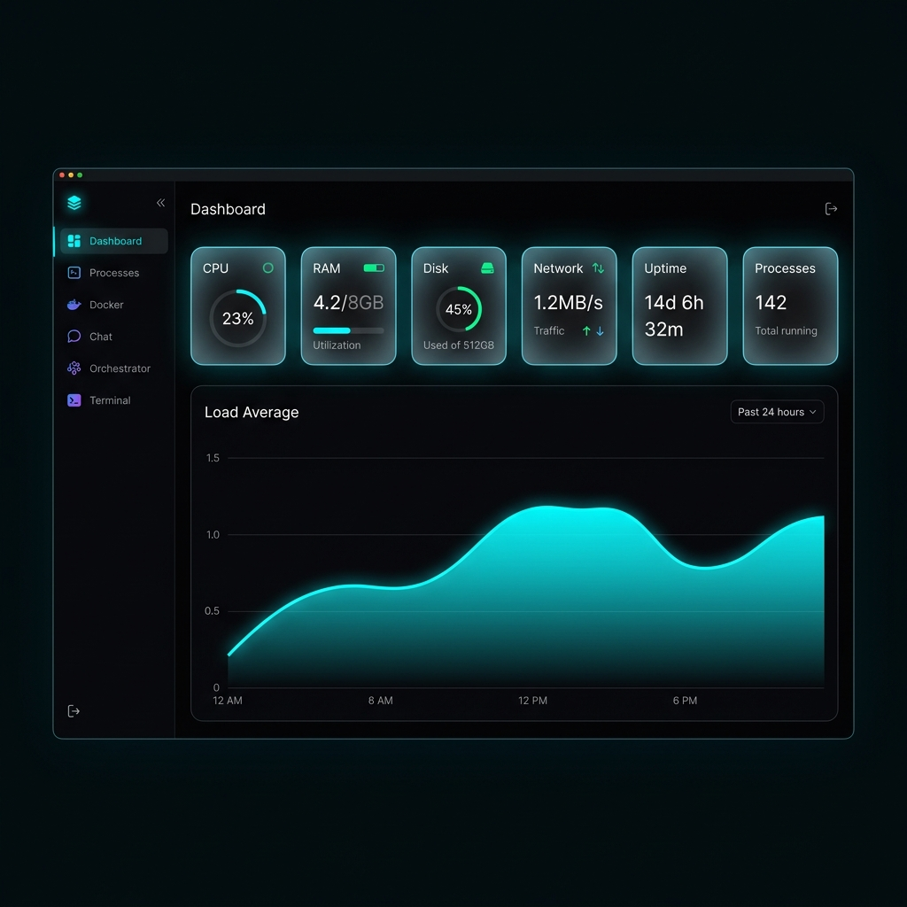

<p align="center">
  
</p>

<h1 align="center">DisprosiumHUB</h1>

<p align="center">
  <em>Multi-Agent AI Orchestration & Home Server Command Center</em>
</p>

<p align="center">
  <strong>🧪 Named after Dysprosium (Dy, Z=66) — the rare earth element that's "hard to obtain".<br>Just like full control over your AI agents and infrastructure.</strong>
</p>

<p align="center">
  <a href="#-features"></a>
  <a href="#-tech-stack"></a>
  <a href="#-tech-stack"></a>
  <a href="#-tech-stack"></a>
  <a href="#-tech-stack"></a>
  <a href="#-tech-stack"></a>
  <a href="LICENSE"></a>
</p>

<br>

<p align="center">
  
</p>

---

## 🔥 What is DisprosiumHUB?

**DisprosiumHUB** is a self-hosted, AI-powered command center that lets you **orchestrate multi-agent AI pipelines** while monitoring and controlling your entire home server — all from a single, beautiful dark-mode interface.

Think of it as **mission control for your home lab**, where your local LLaMA model and Google Gemini in the cloud work together as a team, executing tasks in sequence while you watch in real-time.

```
┌─────────────────────────────────────────────────────────────────┐
│                        DisprosiumHUB                            │
│                                                                 │
│  🏠 Local AI (Ollama)  ←──  🎛️ Orchestrator  ──→  ☁️ Gemini   │
│                              ↓                                  │
│  📁 File System    ⚙️ Commands    🔗 n8n    🐳 Docker           │
│                              ↓                                  │
│                     📡 Real-time Monitor                        │
└─────────────────────────────────────────────────────────────────┘
```

---

## ✨ Features

### 🎛️ AI Orchestrator — *The Core*
Create **multi-step pipelines** that chain AI models with system actions:

| Step Type | Description | Executor |
|-----------|-------------|----------|
| 🏠 `ollama_chat` | Chat with local LLMs (LLaMA, Mistral, etc.) | Ollama (Local) |
| ☁️ `gemini_chat` | Leverage Google Gemini for complex tasks | Gemini API (Cloud) |
| 📁 `create_file` | Generate and save files from AI output | Server |
| ⚙️ `execute_cmd` | Run safe system commands | Server (sandboxed) |
| 🔗 `n8n_webhook` | Trigger automation workflows | n8n |
| 🔀 `condition` | Conditional logic between steps | Built-in |

**Variable Interpolation**: Chain outputs between steps with `{{step_N.output}}` — the output of step 1 becomes the input of step 2.

**SSE Streaming**: Watch your pipeline execute in real-time with a live timeline showing ✅ success, 🔄 running, and ❌ errors.

### 📊 System Dashboard
- Real-time CPU, RAM, Disk & Network monitoring
- Load average sparkline chart (last 30 data points)
- System uptime, hostname, and platform info
- Temperature sensors (when available)

### 🔄 Process Manager
- Top 50 processes sorted by CPU usage
- Filter by name, PID, or username
- One-click kill with confirmation dialog
- Sortable columns (PID, Name, CPU%, RAM%, Status)

### 🐳 Docker Control
- List all containers with status indicators
- Start / Stop / Restart any container
- View ports, images, and creation dates

### 🤖 OpenClaw AI Assistant
- Unified chat interface with conversation memory
- Auto-learning skills system
- Built-in skills: weather, news, file search, disk status
- Falls back to local LLM for general questions
- Conversation history with persistence

### 💻 Web Terminal
- Full PTY terminal via WebSocket
- xterm.js with custom dark theme
- Copy/paste, scrollback, and resize support

### 🔐 Security
- Google OAuth 2.0 authentication
- JWT session tokens with 24h expiration
- Email whitelist (single-user by design)
- Security headers (HSTS, CSP, X-Frame-Options)
- Sandboxed command execution with whitelist

---

## 🏗️ Architecture

```
                    ┌──────────────────────────┐
                    │      Cloudflare Tunnel    │
                    │    (HTTPS / Zero Trust)   │
                    └────────────┬─────────────┘
                                 │
                    ┌────────────▼─────────────┐
                    │    Docker Container       │
                    │    ┌──────────────────┐   │
                    │    │  FastAPI Backend  │   │
                    │    │  (Python 3.11)   │   │
                    │    └───────┬──────────┘   │
                    │            │              │
                    │    ┌───────▼──────────┐   │
                    │    │  Static Frontend  │   │
                    │    │  (Vanilla JS/CSS) │   │
                    │    └──────────────────┘   │
                    └──────┬──────┬──────┬──────┘
                           │      │      │
              ┌────────────┘      │      └────────────┐
              │                   │                    │
     ┌────────▼────────┐  ┌──────▼───────┐  ┌────────▼────────┐
     │  Ollama (Local)  │  │    Docker     │  │   n8n (Local)   │
     │  LLaMA, Mistral  │  │    Engine     │  │  Automations    │
     └─────────────────┘  └──────────────┘  └─────────────────┘
              │
     ┌────────▼────────┐
     │  Gemini API      │
     │  (Cloud, Optional)│
     └─────────────────┘
```

---

## 🚀 Quick Start

### Prerequisites
- Docker & Docker Compose
- [Ollama](https://ollama.ai) installed on the host
- Google OAuth Client ID ([create one here](https://console.cloud.google.com/apis/credentials))
- *(Optional)* [Gemini API Key](https://aistudio.google.com/apikey)

### 1. Clone & Configure

```bash
git clone https://github.com/YOUR_USERNAME/DisprosiumHUB.git
cd DisprosiumHUB

# Configure environment
cp .env.example .env
nano .env
```

```env
GOOGLE_CLIENT_ID=your-google-client-id.apps.googleusercontent.com
JWT_SECRET=your-super-secret-key-here
GEMINI_API_KEY=your-gemini-api-key          # Optional
N8N_API_KEY=your-n8n-api-key                # Optional
ALLOWED_EMAIL=your-email@gmail.com
```

### 2. Build & Run

```bash
docker compose up -d --build
```

### 3. Access

Open `http://your-server:8000` and sign in with Google.

> **Pro tip**: Use [Cloudflare Tunnel](https://developers.cloudflare.com/cloudflare-one/connections/connect-networks/) for secure HTTPS access from anywhere.

---

## 🎯 Orchestrator — Example Pipeline

Create a pipeline that generates a React component library using AI:

```
Pipeline: "Generate React Components"
├── Step 1: ☁️ Gemini → "Generate a Button component with primary and danger variants"
├── Step 2: 📁 File  → Save to /output/Button.jsx using {{step_0.output}}
├── Step 3: ☁️ Gemini → "Generate a Card component with header, body, footer"
├── Step 4: 📁 File  → Save to /output/Card.jsx using {{step_2.output}}
└── Step 5: 🏠 Ollama → "Summarize what was created in the previous steps"
```

The **Monitor** shows real-time progress:
```
✅ Step 1 — gemini_chat — 3.2s
✅ Step 2 — create_file — 0.1s
🔄 Step 3 — gemini_chat — executing...
⏳ Step 4 — create_file — pending
⏳ Step 5 — ollama_chat — pending
```

---

## 🛠️ Tech Stack

| Layer | Technology |
|-------|-----------|
| **Backend** | Python 3.11, FastAPI, Uvicorn |
| **Frontend** | Vanilla JS, CSS (Glassmorphism), xterm.js |
| **Auth** | Google OAuth 2.0, JWT (python-jose) |
| **AI — Local** | Ollama (LLaMA, Mistral, Phi, etc.) |
| **AI — Cloud** | Google Gemini API |
| **Container** | Docker, Docker Compose |
| **Monitoring** | psutil, real-time WebSocket |
| **Automation** | n8n webhooks |
| **Terminal** | PTY + WebSocket (full shell) |

---

## 📁 Project Structure

```
DisprosiumHUB/
├── backend/
│   ├── main.py              # FastAPI application (all endpoints)
│   └── requirements.txt     # Python dependencies
├── frontend/
│   └── index.html           # Single-file UI (CSS + HTML + JS)
├── docker-compose.yml       # Container orchestration
├── Dockerfile               # Production container
├── .env.example             # Environment template
└── README.md
```

---

## 🔑 API Endpoints

<details>
<summary><strong>Authentication</strong></summary>

| Method | Endpoint | Description |
|--------|----------|-------------|
| POST | `/api/auth/google` | Verify Google token, issue JWT |
| GET | `/api/auth/me` | Get current user info |

</details>

<details>
<summary><strong>System Monitoring</strong></summary>

| Method | Endpoint | Description |
|--------|----------|-------------|
| GET | `/api/system` | CPU, RAM, Disk, Network metrics |
| GET | `/api/processes` | Top 50 processes |
| DELETE | `/api/processes/{pid}` | Kill a process |

</details>

<details>
<summary><strong>Docker</strong></summary>

| Method | Endpoint | Description |
|--------|----------|-------------|
| GET | `/api/docker` | List all containers |
| POST | `/api/docker/{name}/{action}` | Start/Stop/Restart container |

</details>

<details>
<summary><strong>Orchestrator</strong></summary>

| Method | Endpoint | Description |
|--------|----------|-------------|
| GET | `/api/orchestrator/pipelines` | List all pipelines |
| POST | `/api/orchestrator/pipelines` | Create pipeline |
| GET | `/api/orchestrator/pipelines/{id}` | Get pipeline |
| PUT | `/api/orchestrator/pipelines/{id}` | Update pipeline |
| DELETE | `/api/orchestrator/pipelines/{id}` | Delete pipeline |
| POST | `/api/orchestrator/run/{id}` | Execute pipeline (SSE) |
| POST | `/api/orchestrator/step` | Test single step |

</details>

<details>
<summary><strong>AI Chat</strong></summary>

| Method | Endpoint | Description |
|--------|----------|-------------|
| POST | `/api/chat` | Send message to AI |
| GET | `/api/conversations` | List conversations |
| POST | `/api/openclaw/execute` | Execute OpenClaw skill |

</details>

---

## 🤝 Contributing

Contributions are welcome! Please read the [Contributing Guide](CONTRIBUTING.md) before submitting a PR.

1. Fork the repository
2. Create your feature branch (`git checkout -b feature/amazing-feature`)
3. Commit your changes (`git commit -m 'feat: add amazing feature'`)
4. Push to the branch (`git push origin feature/amazing-feature`)
5. Open a Pull Request

---

## 📝 License

This project is licensed under the MIT License — see the [LICENSE](LICENSE) file for details.

---

## 👨‍💻 Author

**Cristian Ávila Elgueta**
- Geological Engineer | Full-Stack Developer | AI Systems Architect
- 🏢 [GeologgIA](https://geologgia.cl) — Geological Intelligence
- 🏢 [TECKNOLOGÍA](https://tecknologia.cl) — Technology Solutions
- 🧪 Named after [Dysprosium (Dy)](https://en.wikipedia.org/wiki/Dysprosium) — the rare earth element that powers the future

---

<p align="center">
  <em>Built with 🧪 and ☕ in Chile</em><br>
  <sub>Because rare elements deserve rare tools.</sub>
</p>
